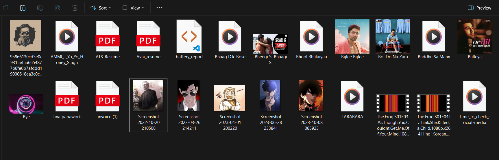
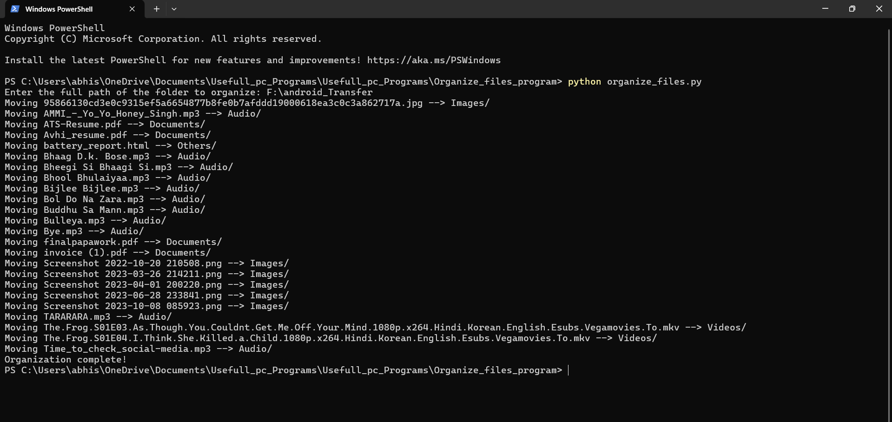
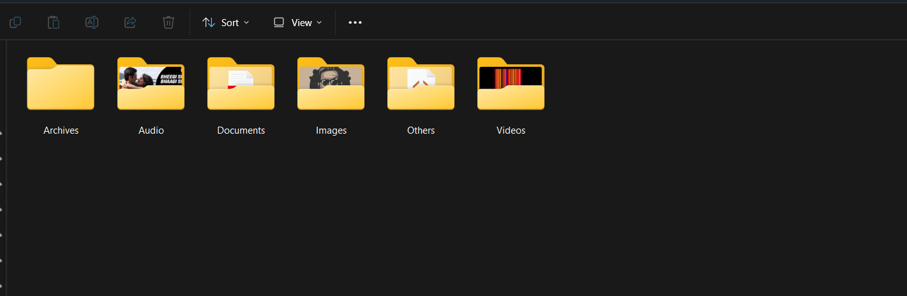

# 🗂️ File Organizer Utility

This Python program helps you automatically organize files in a specified folder by categorizing them into types such as Images, Audio, Documents, Videos, Archives, and Others.  
It simplifies file management by moving files into appropriate folders based on their type and size.

## ⚙️ Features

- Supports a wide range of file types:
    - **Images**: `.jpg`, `.jpeg`, `.png`, `.gif`, `.bmp`, `.tiff`
    - **Audio**: `.mp3`, `.wav`, `.aac`, `.flac`, `.ogg`
    - **Documents**: `.pdf`, `.doc`, `.docx`, `.txt`, `.xls`, `.xlsx`, `.ppt`, `.pptx`
    - **Videos**: `.mp4`, `.avi`, `.mkv`, `.mov`, `.flv`
    - **Archives**: `.zip`, `.rar`, `.7z`, `.tar`, `.gz`
- Automatically creates categorized folders if not present
- Small files (≤10 KB) are moved to the **Others** folder
- Provides clear console output indicating file movements

## 📸 Screenshots

### Folder Path Prompt  


### Processing Output  


### Final Cleanup Result  



## 🚀 Installation & Usage

1. Install Python (if not already installed):  
   Download from https://www.python.org/downloads/

2. Run the program:

    ```bash
    python file_organizer.py
    ```

3. When prompted, enter the **full absolute path** of the folder you want to organize, for example:

    ```text
    📁 Enter the full path of the folder to organize: C:\Users\YourName\Downloads
    ```

4. The program will process the folder, moving files into their respective folders automatically.

## ⚠️ Important Notice

- Make sure to **backup your files** before running the program, as files are moved automatically.
- Provide the **absolute path** without quotes when prompted (e.g., `C:\Users\YourName\Downloads`).
- Small files (≤10 KB) are always moved to the "Others" folder.

## 📄 License

This project is open-source and free to use.

---

Happy organizing! 📂✨
