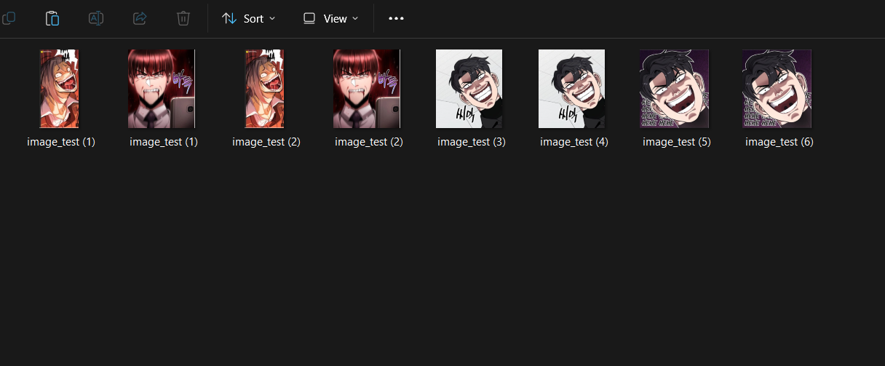
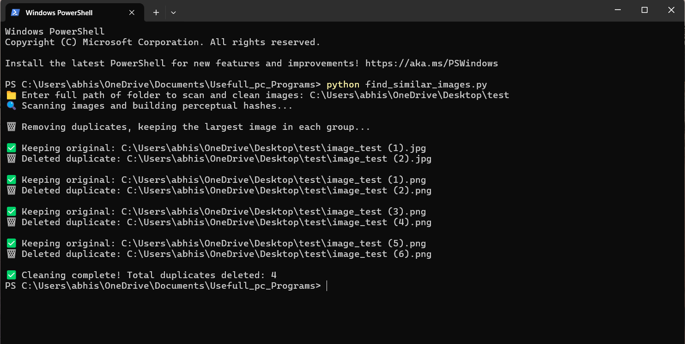
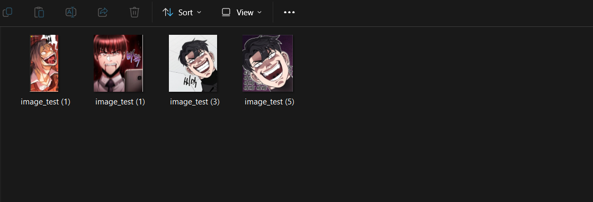

# 🗂️ Image Duplicate & Similar Cleaner

This Python program helps you clean up your image collection by finding and deleting duplicate or highly similar images in a specified folder.  
It works by computing perceptual hashes (pHash) of images and comparing them to detect similarity.  
For each group of similar images, the program keeps the highest quality image (largest file size and resolution) and deletes the rest automatically.

## ⚙️ Features

- Supports common image formats: `.jpg`, `.jpeg`, `.png`, `.bmp`, `.gif`, `.tiff`
- Detects visually similar images based on a customizable threshold
- Keeps the largest and highest resolution image in each group
- Deletes exact duplicates and visually similar images
- Provides informative console output during processing

## 📸 Screenshots

### Example 1 – Folder Path Prompt  


### Example 2 – Processing Output  


### Example 3 – Final Cleanup Result  



## 🚀 Installation & Usage

1. Install Python (if not already installed):  
   Download from https://www.python.org/downloads/

2. Install required libraries using pip:

    ```bash
    pip install Pillow imagehash
    ```

3. Run the program:

    ```bash
    python find_similar_images.py
    ```

4. When prompted, enter the **full absolute path** of the folder you want to scan, for example:

    ```text
    📁 Enter full path of folder to scan and clean images: C:\Users\YourName\Pictures
    ```

5. The program will scan, detect similar images, and delete duplicates automatically, keeping the best version in each group.

## ⚠️ Important Notice

- Make sure to **backup your images** before running the program, as deleted files cannot be recovered by the script.
- The similarity threshold can be adjusted in the script by modifying:

    ```python
    find_and_clean_similar_images(folder_path, threshold=5)
    ```
- Be sure to paste **absolute path** ( C:\Users\abhis\OneDrive\Desktop\test ) **without** "" ( "C:\Users\abhis\OneDrive\Desktop\test" )

## 📄 License

This project is open-source and free to use.

---

Happy image cleaning! 🚿📷

